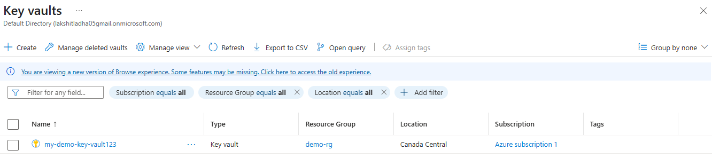
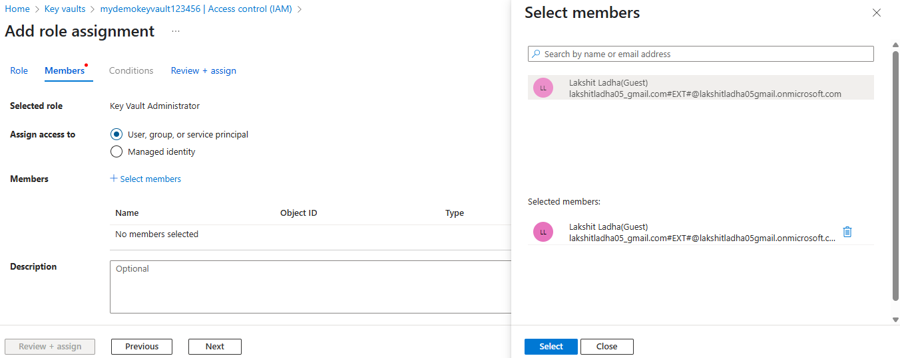
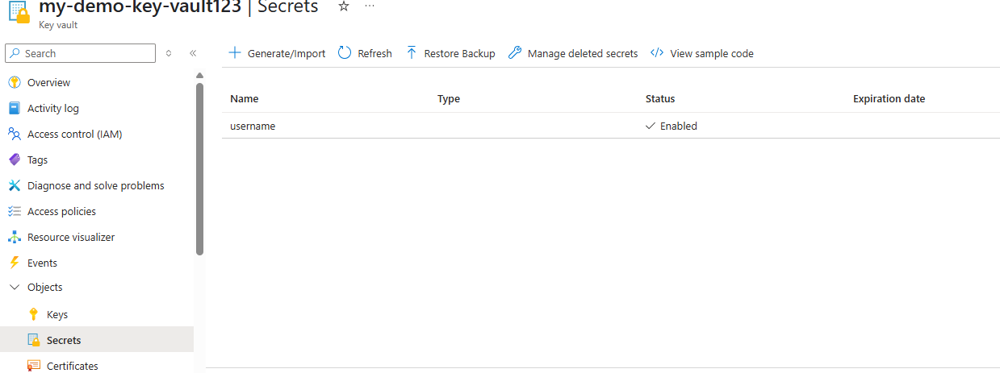
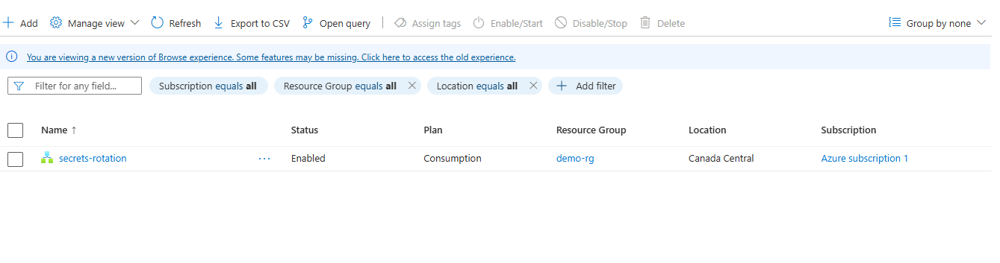
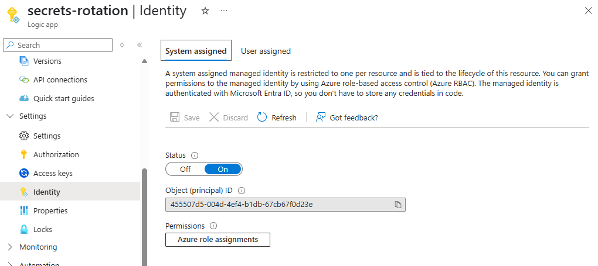
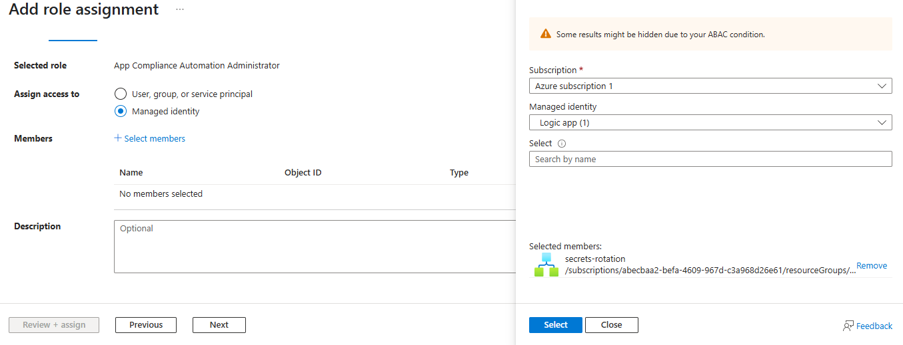
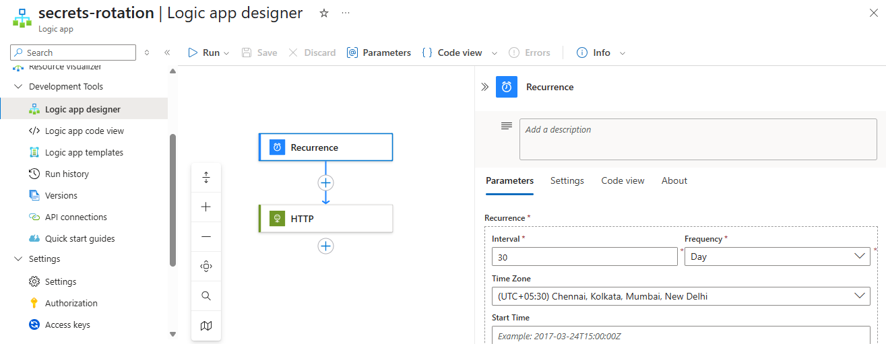
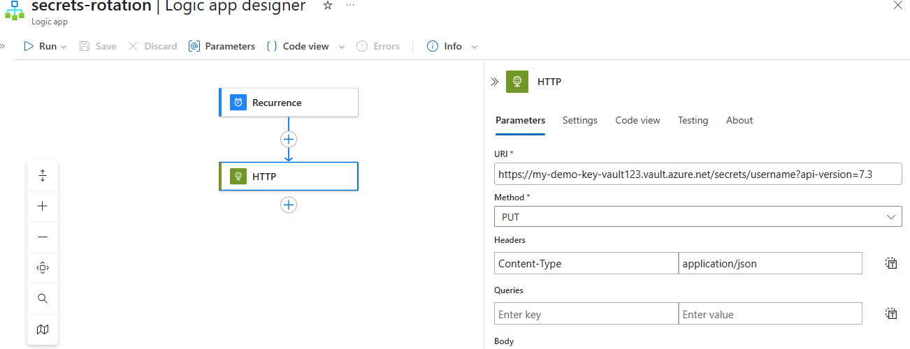
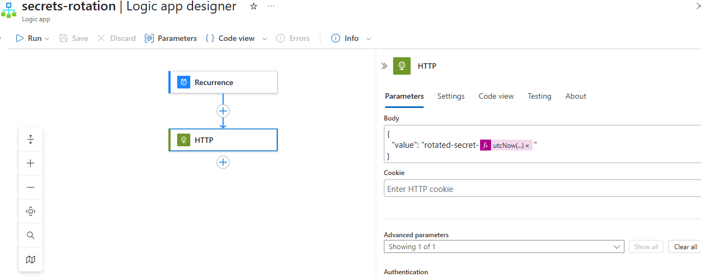
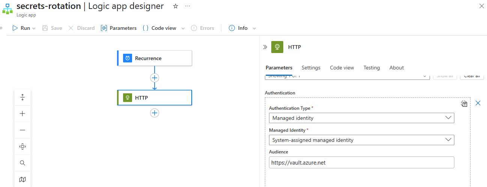

Steps:

1. Go to your azure portal, in the search bar at the top, type “Key Vaults” and select it. Click "+ Create", fill in the following info such as: Subscription, Resource Group, Key Vault Name, Region. Click "Review + Create", then Create.
 

2. Now, try creating a secret, but you will be denied as there are no permissions attached to the user to access this key-vault that we created.
 

3. Go to Access Control(IAM), and add the current user with required permissions to access the key-vault. 

4. Now, open the key-vault that we created and under objects select secrets, click on generate/import secret. Add name of secret, it values, select resource group and subscritpion as well. And, finally click on create secret. You can verify that the secret is created.

5. Now search for "logic apps", and create a new logic-app. Add rqeuired information such as name, resource group and subscription. Click on review + create and finally create.

6. Now, open the logic app that we created and under security, choose Identities and set the system-designed identity status as "on".

7. Now, open the key-vault and choose teh key-vault that we created, under Access Control(IAM), select "+ add", then choose "add a role assignment", choose the "Assign access to" -> "managed identities", add the logic-app, the name of logic app that we created.
Fnally, save.

8. Go to logic-app, under this go to logic-app designer, choose the logic-app that we created. Under "Development Tools", choose "Logic app Designer" and create the follwing workflow as in below images: 

 

 

 