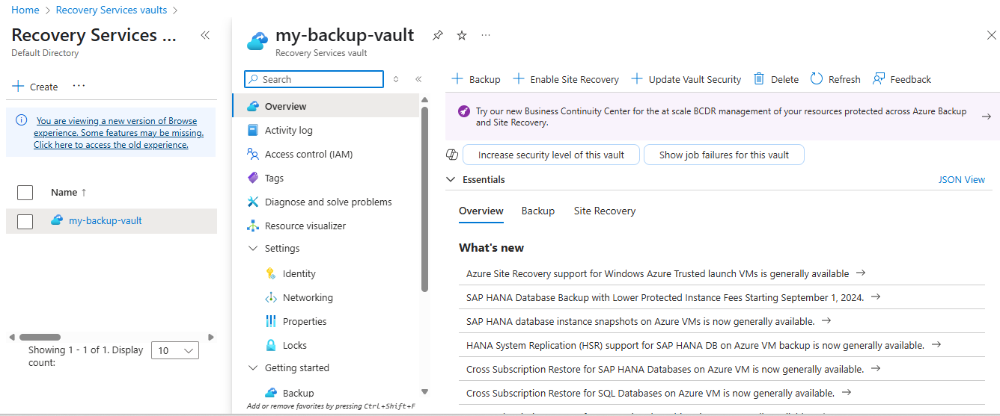
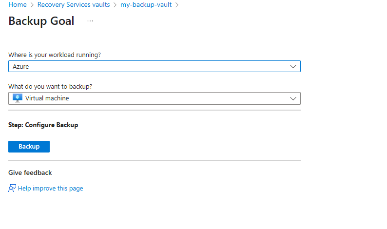
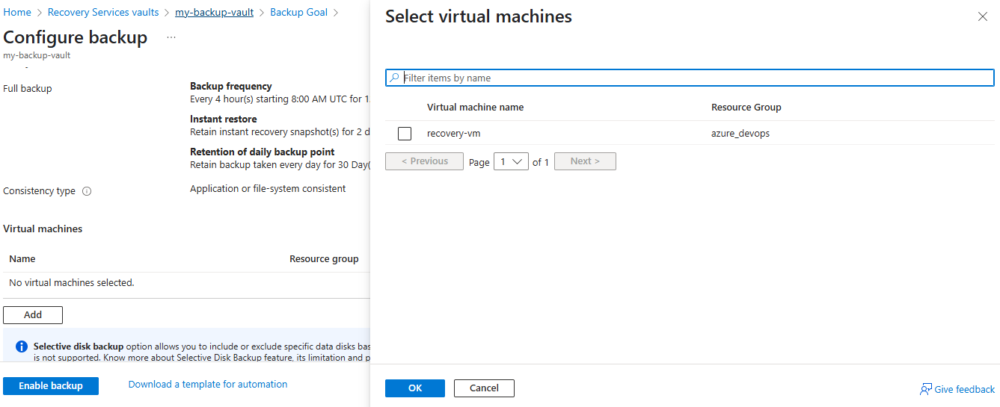
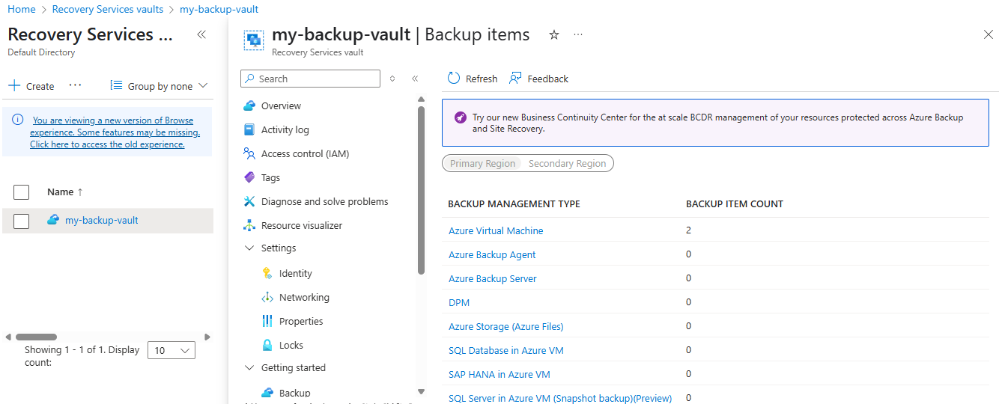
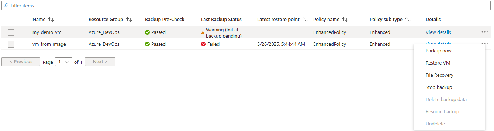
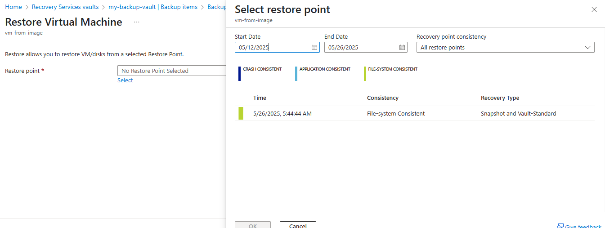
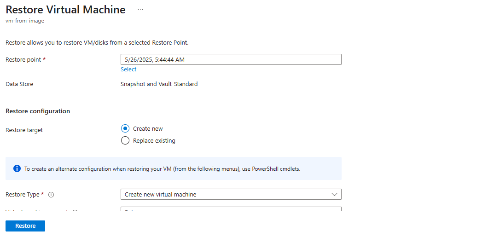
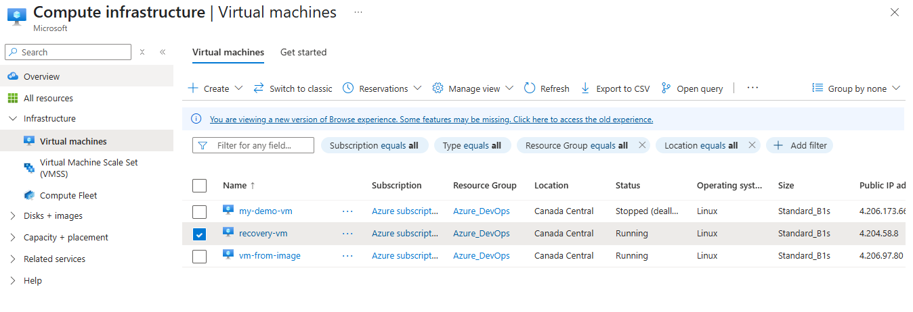

### Set up Azure Backup to back up a VM’s disks to a Recovery Services Vault

1. Go to your azure portal, search for "Recovery Services Vaults", click "+ Create", 
Vault name, Resource group, Region. Click "Review + Create", then "Create".
 
2. Set Up Backup for the VM, after the vault is created, open it Go to the left menu, choose "Backup", under "Where is your workload running?" → choose:Azure.
Under "What do you want to back up?" → choose: Virtual Machine
Click Backup. Now, Select the subscription and resource group, choose the VM you want to back up, click Enable backup. And the backup policy will be created.

 

3. Run the Initial Backup, in the Recovery Services Vault → go to Backup items. Select Azure Virtual Machine. Find your VM and click Backup now, Choose the time → click OK.

### Restore the VM from Backup
1. Go to Backup Items. In your Recovery Services Vault, go to Backup Items. Click Azure Virtual Machine. Select the VM you want to restore

2. Restore the VM, click on  Restore VM. Choose the restore point (date and time)
Choose Restore Type: Create new VM, You can also choose Disk-only if you want to attach disks manually, customize name/location if needed and click Restore. Azure will create a new VM based on the backup, this can be verified by going into VM and you can see your VM.
 
 

> Verify whether virtual machine has been created or not.
