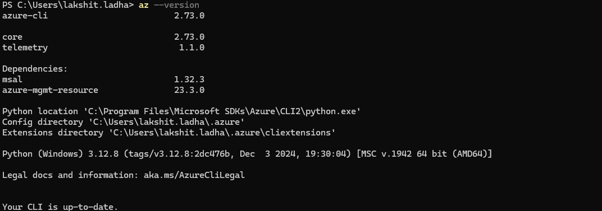
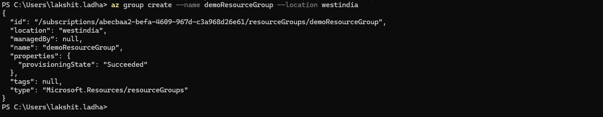
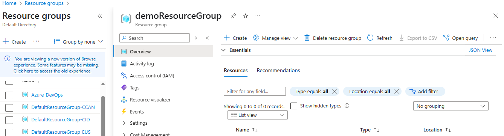
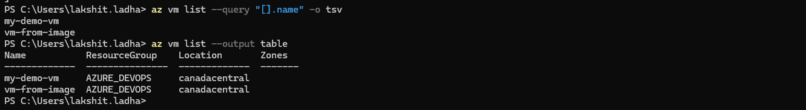
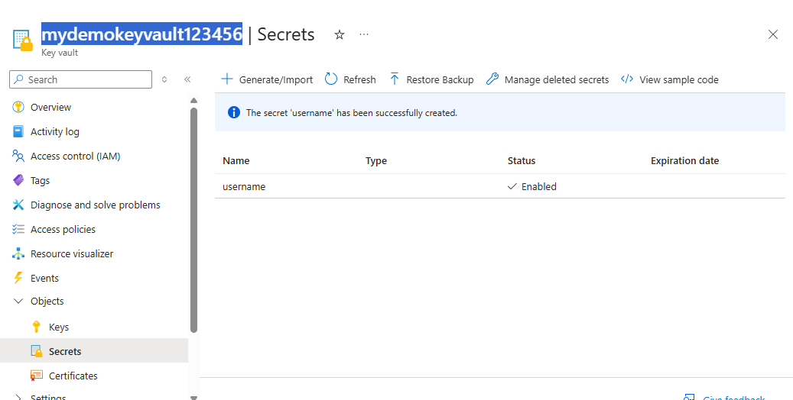
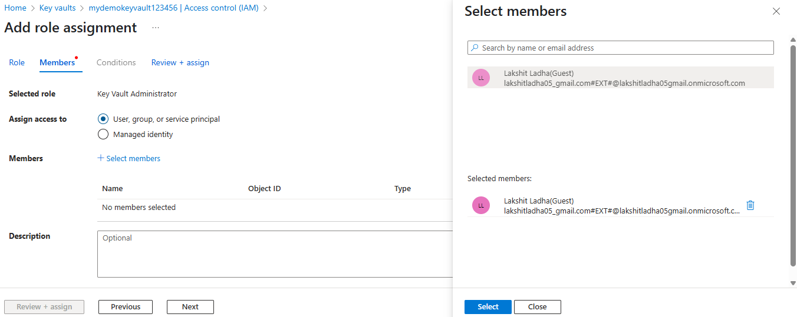
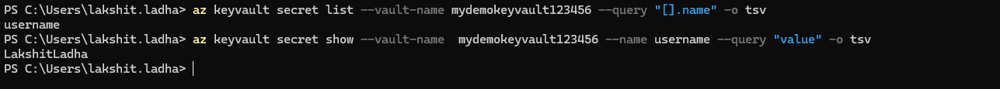

### 1. Install Azure PowerShell and create an Azure resource using a PowerShell script.
#### Steps:
1. Got to browser  and search for Azure CLI install for windows, click on install and complete the setup.

2. Now, verify whether Azure CLI has been installed or not, by using "az --version".
 

3. Now, use command "az login", this will prompt microsoft signin window, enter the microsoft account and you will connected with your azure account.
 

4. Create a resourcegroup using the command:
```bash
 az group create --name <resourceGroup_name> --location <region>
```

> Also verify by opening your azure portal:<br>


### 2. List all VMs in your account using Azure CLI.
#### Steps:

1. To list the Vm's, you can use the following commnads:
```bash
az vm list --query "[].name" -o tsv
# or
az vm list --output table
```


### 3. Access a Key Vault secret using Azure CLI.
#### Steps:

1. Go to azure portal and create a Key-vault by selecting Subscription, Resource Group, Key-Vault and region name. Click on "review + create", and finally click on create.


2. Now, once the resource is created, go to the vault and under Access Control(IAM), go to role assignments, add the role and assign the role to the user. Now, add a secret that will later be accessed using the Azure CLI.
 

3. In your powershell, write the following command:
```bash
# list the secrets present in the key-vault
az keyvault secret list --vault-name <key_vault_name> --query "[].name" -o tsv

# retrieve value of the secret
az keyvault secret show --vault-name <key_vault_name> --name <secret_name> --query "value" -o tsv
```
