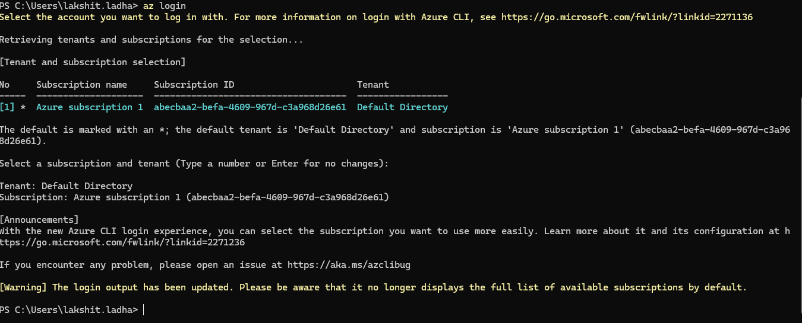
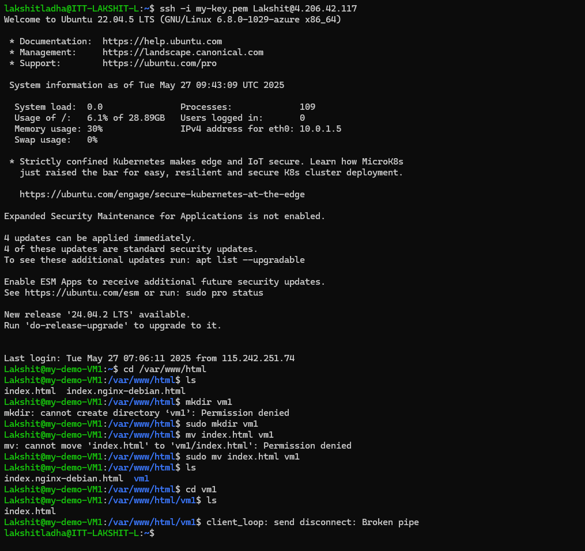
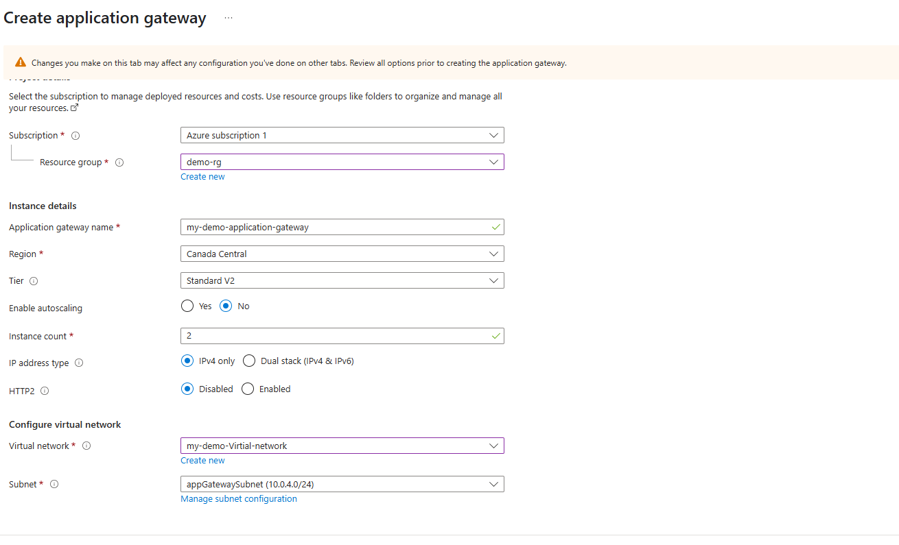
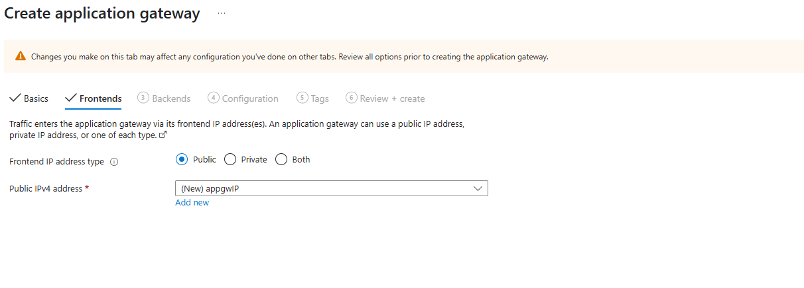
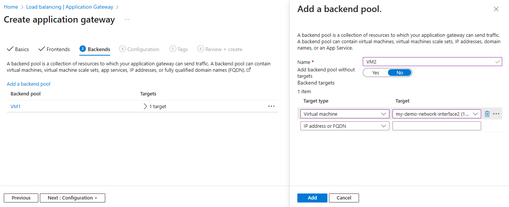
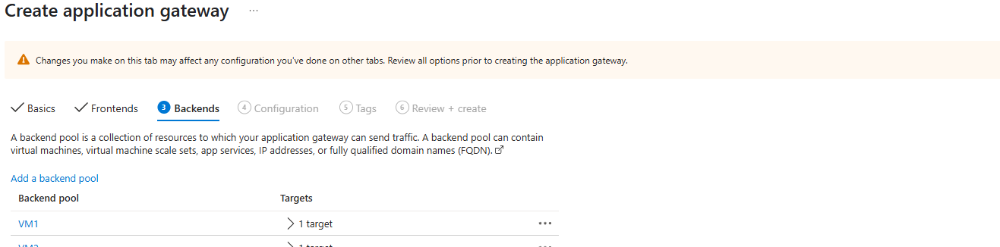
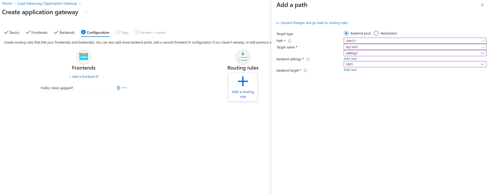
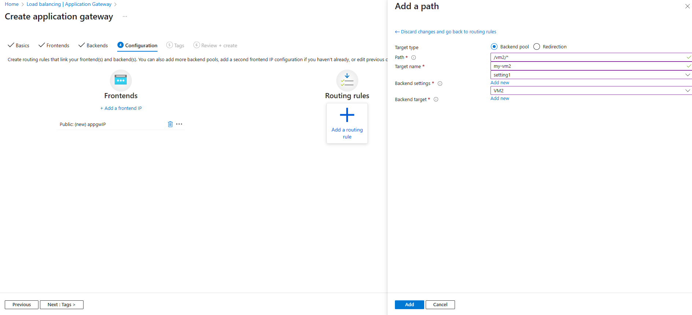
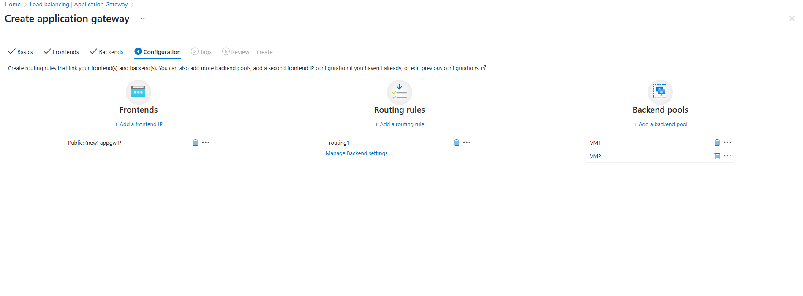

Steps:

1. Open the terminal and login to your Azure account, use:
```bash
az login
```


2. Now, create a resource group from CLI using the command:
```bash
az group create --name <ResourceGroupName> --location <AzureRegion>
```

3. Now, write an ARM template to create a Vnet, create a subnet inside it and host 2 VM's inside the subnet, also enable required security rules.
The ARM template is attached here, run the following command:
```bash
az deployment group create --resource-group <ResourceGroupName> --template-file <PathToTemplateFile>
```
You can go to azure portal and verify whether the resources has been successfully created or not.

4. SSH into both the virtual machines, and run:
```bash
sudo apt update
sudo apt install nginx -y
echo "<h1>Hello from Lakshit's VM1</h1>" | sudo tee /var/www/html/index.html
```
Inside "/var/www/html", create a directory "vm1", and move "index.html" to "vm1".
Do the same for VM2.


5. Now, open your azure account and create a apllication gateway, make sure the application gateway is created in a new subnet and that subnet should only contain the apllication gateway.
Follow the steps as in images to configure the Application gateway.
 
 
 
 
 
 


6. Now, copy the IP address of the Apllication Gateway, and run on browser:
<http://<ip_address_AG>>
Now, add a path "vm1" and "vm2" to this url you will see different web pages been served.
 
